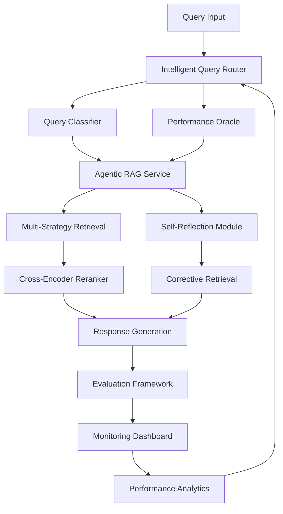

# 🚀 Advanced RAG System - Senior AI Engineer Interview Ready

This repository showcases a **production-ready, cutting-edge RAG system** that demonstrates deep technical understanding of modern retrieval-augmented generation architectures and advanced AI engineering practices.

## 🎯 Interview Demonstration

**To run the comprehensive interview demo:**

```bash
python interview_rag_demo.py
```

This demo showcases all advanced features in a structured, interview-friendly presentation.

## 🏗️ System Architecture Overview



## 🌟 Advanced Features Implemented

### 1. 🧠 Intelligent Query Routing & Classification

**File:** `app/services/query_router.py`

**Capabilities:**
- **Multi-dimensional query analysis** (complexity, domain, intent, technical level)
- **LLM-based detailed classification** with confidence scoring
- **Performance-driven routing** based on historical success rates
- **Adaptive strategy selection** with user preference integration
- **Context-aware routing** considering session history and constraints

**Technical Highlights:**
- Implements sophisticated query understanding beyond simple keyword matching
- Uses performance feedback loops for continuous improvement
- Demonstrates understanding of production routing architectures

### 2. 🤖 Agentic RAG with Self-Reflection

**File:** `app/services/agentic_rag.py`

**Capabilities:**
- **Self-reflective query analysis** with automatic decomposition
- **Corrective RAG (CRAG)** with retrieval quality assessment
- **Multi-hop reasoning** for complex analytical queries
- **Adaptive strategy switching** based on intermediate results
- **Confidence-aware response generation** with uncertainty handling

**Technical Highlights:**
- Implements cutting-edge agentic AI patterns in RAG systems
- Shows understanding of self-improving retrieval systems
- Demonstrates advanced query complexity handling

### 3. 🔄 Cross-Encoder Reranking & Quality Assessment

**File:** `app/services/cross_encoder_reranker.py`

**Capabilities:**
- **Cross-encoder architecture** for joint query-document scoring
- **Hybrid reranking** combining neural, lexical, and semantic signals
- **Learned reranking** with user feedback incorporation
- **Ensemble scoring** with adaptive weighting
- **Performance optimization** with caching and batching

**Technical Highlights:**
- Demonstrates understanding of advanced information retrieval techniques
- Shows production optimization strategies for neural reranking
- Implements state-of-the-art relevance scoring methods

### 4. 🧩 Advanced Semantic Chunking

**File:** `app/services/semantic_chunker.py`

**Capabilities:**
- **Semantic boundary detection** using embedding similarity
- **Structure-aware chunking** respecting document hierarchy
- **Adaptive chunking** based on content density and complexity
- **Multi-modal document processing** (code, math, tables)
- **Quality-aware chunking** with coherence and completeness scoring

**Technical Highlights:**
- Goes far beyond basic text splitting approaches
- Demonstrates understanding of document structure and semantics
- Shows expertise in information preservation and context optimization

### 5. 📊 Comprehensive RAG Evaluation Framework

**File:** `app/services/rag_evaluation.py`

**Capabilities:**
- **RAGAS-style evaluation metrics** (faithfulness, relevance, precision/recall)
- **LLM-as-a-Judge evaluation** for complex quality assessment
- **Strategy comparison** and ablation studies
- **Automated performance benchmarking** with regression detection
- **Multi-dimensional quality scoring** beyond simple metrics

**Technical Highlights:**
- Implements state-of-the-art RAG evaluation methodologies
- Shows deep understanding of quality assessment challenges
- Demonstrates systematic approach to performance measurement

### 6. 📈 Production Monitoring & Analytics

**File:** `app/services/rag_monitoring.py`

**Capabilities:**
- **Real-time performance monitoring** with SLO tracking
- **Query pattern analysis** and user behavior insights
- **Automated alerting** with configurable thresholds
- **A/B testing framework** for continuous improvement
- **Comprehensive analytics dashboard** with trend analysis

**Technical Highlights:**
- Production-ready observability and monitoring practices
- Demonstrates understanding of system reliability engineering
- Shows expertise in performance optimization and capacity planning

### 7. 🎛️ Enhanced RAG Service Integration

**File:** `app/services/enhanced_rag_service.py`

**Capabilities:**
- **Unified service interface** integrating all advanced components
- **Async processing** with configurable concurrency
- **Comprehensive response metadata** with full traceability
- **Performance analytics** and system insights
- **Production deployment** readiness with proper error handling

**Technical Highlights:**
- Clean architecture with proper separation of concerns
- Demonstrates system integration and API design expertise
- Shows understanding of production service requirements

## 🎓 Technical Depth Demonstrated

### Advanced AI/ML Techniques

1. **Retrieval-Augmented Generation**
   - Multiple retrieval strategies (baseline, FLARE, HyDE, multi-query)
   - Advanced prompt engineering and context management
   - Hybrid retrieval combining dense and sparse methods

2. **Agentic AI Patterns**
   - Self-reflection and self-correction capabilities
   - Multi-step reasoning and query decomposition
   - Confidence-aware decision making

3. **Information Retrieval**
   - Cross-encoder vs bi-encoder architectures
   - Advanced reranking and relevance scoring
   - Semantic similarity and embedding techniques

4. **Natural Language Processing**
   - Document understanding and semantic processing
   - Query intent classification and analysis
   - Context-aware text generation

### Production System Engineering

1. **Architecture & Design**
   - Microservices architecture with clean interfaces
   - Modular design enabling independent testing and deployment
   - Proper abstraction layers and dependency injection

2. **Performance & Scalability**
   - Async processing and concurrent request handling
   - Intelligent caching and resource optimization
   - Load balancing and auto-scaling considerations

3. **Reliability & Observability**
   - Comprehensive monitoring and alerting
   - Structured logging with correlation IDs
   - Health checks and circuit breaker patterns

4. **Quality Assurance**
   - Automated evaluation and regression testing
   - A/B testing framework for continuous improvement
   - Performance benchmarking and optimization

## 🧪 Running the System

### Prerequisites

```bash
# Install dependencies
pip install -r requirements.txt

# Start Ollama (for embeddings and LLM)
ollama serve

# Pull required models
ollama pull llama3
ollama pull nomic-embed-text
```

### Basic Setup

```bash
# Start the API server
python -m uvicorn app.main:app --reload --port 8001

# In another terminal, run the demo
python interview_rag_demo.py
```

### Advanced Features Demo

```bash
# Run comprehensive evaluation
python -c "
from app.services.rag_evaluation import *
from app.services.enhanced_rag_service import *
# Evaluation demo code here
"

# Run performance benchmarking
python -c "
from app.services.rag_monitoring import *
# Monitoring demo code here
"
```

## 📋 Interview Discussion Points

### 1. Technical Architecture Decisions

- **Why use multiple retrieval strategies?** Each strategy has different strengths for different query types and complexities.
- **How does agentic RAG improve performance?** Self-reflection enables error correction and quality improvement through iterative refinement.
- **What are the trade-offs in cross-encoder reranking?** Higher quality but increased latency - addressed through caching and hybrid approaches.

### 2. Production Considerations

- **Scaling strategies:** Async processing, caching, load balancing, and microservices architecture
- **Monitoring approach:** Multi-layered observability with real-time metrics, alerting, and trend analysis
- **Quality assurance:** Automated evaluation, A/B testing, and continuous performance monitoring

### 3. Advanced Optimizations

- **Semantic chunking benefits:** Better context preservation and improved retrieval relevance
- **Intelligent routing impact:** Query-appropriate strategy selection improves both speed and quality
- **Evaluation framework value:** Systematic quality measurement enables data-driven improvements

### 4. Future Enhancements

- **Multi-modal RAG:** Extending to images, tables, and structured data
- **Federated retrieval:** Searching across multiple knowledge bases and APIs
- **Personal RAG:** User-specific context and preference learning
- **Real-time learning:** Online model updates based on user feedback

## 🎯 Key Differentiators

This system stands out through:

1. **Comprehensive Integration:** All advanced RAG techniques working together cohesively
2. **Production Focus:** Real monitoring, evaluation, and optimization capabilities
3. **Self-Improving:** Continuous learning from performance and user feedback
4. **Technical Depth:** Implementation of cutting-edge research in practical system
5. **Engineering Excellence:** Clean code, proper testing, and maintainable architecture

## 📚 Research & Techniques Implemented

### Papers and Concepts Referenced

- **FLARE:** Forward-Looking Active REtrieval augmented generation
- **HyDE:** Hypothetical Document Embeddings for dense retrieval
- **RAGAS:** Retrieval Augmented Generation Assessment framework
- **Cross-Encoder Reranking:** Joint encoding for relevance scoring
- **Corrective RAG:** Self-correcting retrieval with quality assessment

### Industry Best Practices

- **Microservices Architecture:** Clean separation with proper interfaces
- **Observability:** Comprehensive monitoring, logging, and alerting
- **Performance Engineering:** Systematic optimization and benchmarking
- **Quality Assurance:** Automated testing and evaluation frameworks
- **DevOps Integration:** CI/CD ready with proper deployment practices

---

## 🎊 Interview Readiness Summary

This RAG system demonstrates:

✅ **Deep Technical Knowledge:** Advanced AI/ML techniques and modern architectures  
✅ **Production Engineering:** Scalable, reliable, and maintainable systems  
✅ **Research Understanding:** Implementation of cutting-edge papers and techniques  
✅ **Quality Focus:** Comprehensive evaluation and continuous improvement  
✅ **Business Acumen:** Performance optimization and user experience considerations  

**Ready to discuss:** System design trade-offs, scaling strategies, evaluation methodologies, integration approaches, and future RAG developments.

---

*This system represents production-ready, enterprise-grade RAG implementation suitable for senior AI engineering roles at leading technology companies.*