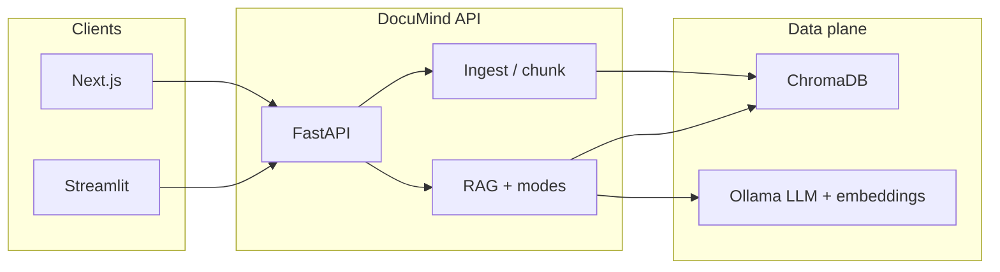

# DocuMind

**DocuMind** is a **local-first**, **grounded** retrieval-augmented generation (RAG) platform for research and technical document libraries. Ingest PDF, DOCX, and plain text; optionally fetch arXiv PDFs by ID; index into a **persistent vector store**; query through a **versioned REST API** with **citation-backed** answers and multiple **task-specific** reasoning modes.

Default inference uses **Ollama** (`llama3`, `nomic-embed-text`) on infrastructure you control—no third-party LLM API keys required for the baseline deployment.

---

## At a glance

| Dimension | Summary |
|-----------|---------|
| **Workload** | Multi-document Q&A, comparison, methodology extraction, dataset inventory, reproducibility checklists |
| **API** | FastAPI, OpenAPI (`/docs`), `/api/v1/*` with optional **API key** enforcement |
| **Persistence** | ChromaDB on disk; configurable path and collection name |
| **Clients** | Next.js 15 operator dashboard (`web/`); optional Streamlit UI (`frontend/app.py`) |
| **Quality gates** | `pytest` suite; optional evaluation fixtures under `evaluation/` |
| **Container** | `Dockerfile` (Python 3.11-slim, non-root user); `docker-compose.yml` with volume-backed Chroma and Compose **healthcheck** |

---

## Architecture



1. **Ingestion** — Type and size validation; text extraction (PyPDF2, python-docx, raw text); lightweight metadata (title, authors, year, arXiv id when detectable).
2. **Chunking** — LangChain `RecursiveCharacterTextSplitter` with configurable `CHUNK_SIZE` / `CHUNK_OVERLAP`; section hints from leading lines.
3. **Indexing** — Embeddings via Ollama; vectors stored in Chroma with cosine distance.
4. **Retrieval** — Top‑k retrieval, optional **section filter**, distance threshold, **keyword-overlap rerank**, and **cross-document diversity** so a single paper does not dominate the context window. Optional **fallback retrieval** when strict thresholds would return nothing (tunable).
5. **Generation** — Mode-specific system prompts; structured **source citations** on responses; optional **FLARE-inspired** second retrieval pass (see below).

Application services are wired through FastAPI **lifespan** hooks (singletons for embedding, document, and RAG services).

---

## Capabilities

- **Formats** — `.pdf`, `.docx`, `.txt` upload; arXiv fetch by ID.
- **Query modes** — `general`, `compare`, `methodology`, `datasets`, `reproduce` (see [Query modes](#query-modes)).
- **FLARE-style active retrieval** (optional) — Second embedding search when a short **forward-looking draft** marks uncertainty (`???` or explicit excerpt-level hedges). Full [FLARE](https://arxiv.org/abs/2305.06983) uses token logprobs; Ollama chat here does not expose them, so this is a **documented, heuristic** variant. Enable with `use_flare` on `POST /api/v1/query`, UI toggle, or `FLARE_ACTIVE_RETRIEVAL=true`. **Dataset Finder** mode skips FLARE (deterministic extraction path).
- **Bundled corpus** — `data/sample_docs/` ships **~460** UTF-8 technical briefs (landmark-style summaries plus **400** reproducible `sample_corpus_p7_*.txt` synth papers from `scripts/generate_production_corpus.py`). Indexed as `sample_*` document ids; expect **on the order of 5k–10k chunks** after ingest (depends on `CHUNK_SIZE`). Bump **`SAMPLE_CORPUS_VERSION`** (now **7**) to purge and re-seed sample rows on startup (requires Ollama). Regenerate or resize: `python scripts/generate_production_corpus.py --count 500 --force`.
- **Bulk arXiv** — `scripts/bulk_ingest_arxiv.py` with `data/arxiv_seed_list.txt` (client-side throttling).

---

## Production and operations

### Health and readiness

| Endpoint | Role |
|----------|------|
| `GET /health/live` | **Liveness** — process accepts traffic (orchestrator / LB probe). |
| `GET /health/ready` | **Readiness** — **200** when Ollama and Chroma are usable; **503** when dependencies are degraded. |
| `GET /health` | Aggregate status: models, collection statistics, degraded vs. healthy. |

### Observability

- **`X-Request-ID`** on responses; correlated in application logs.
- **`LOG_JSON=true`** — structured JSON log lines for log aggregation stacks.
- **`LOG_LEVEL`** — standard Python logging levels.

### Security controls

- **`API_KEY`** — When set, `/api/v1/*` requires header **`X-API-Key`** (omit in local dev when using the bundled UI without a key).
- **`CORS_ORIGINS`** — Explicit allowlist; **`CORS_ALLOW_ALL`** for tightly controlled local demos only.
- **`TRUSTED_HOSTS`** — Optional `TrustedHostMiddleware` when terminating TLS at a reverse proxy.
- **`DISABLE_OPENAPI`** — Disable `/docs` and `/redoc` in locked-down environments.
- **Response compression** — `ENABLE_RESPONSE_GZIP` when clients send `Accept-Encoding: gzip`.
- **Chroma telemetry** — Anonymized telemetry defaulted off unless opted in at the library level.

Secrets belong in **environment** or a secrets manager—never commit `.env` (see `.gitignore`).

### Deployment patterns

| Pattern | Notes |
|---------|--------|
| **Docker Compose** | `docker compose up --build` — API on **8001**, Chroma in named volume `chroma_data`, `./data` mounted read-only. **Ollama is expected on the host** at `http://host.docker.internal:11434` (Docker Desktop). Adjust `OLLAMA_BASE_URL` for Linux hosts or sidecar layouts. |
| **Process + reverse proxy** | Run Uvicorn behind nginx, Traefik, or cloud LB; terminate TLS at the edge; set `TRUSTED_HOSTS` and narrow `CORS_ORIGINS`. |
| **Windows developer loop** | `.\start_documind.ps1` / `.\stop_documind.ps1` — fixed ports **8001** (API), **3002** (Next.js). Use `-SkipModelPull` after initial model pull. |

### Data lifecycle and backup

- **Vector index** — Lives under `CHROMA_PERSIST_DIR` (default `./chroma_db`; Docker: `/app/chroma_db` volume). **Back up this directory** for disaster recovery; re-ingest from source documents if rebuilding from scratch.
- **Operational change** — Raising `SAMPLE_CORPUS_VERSION` triggers removal and re-indexing of `sample_*` documents on next startup.

### Resource guidance

- **Python** — **3.11+** for production alignment with the `Dockerfile`; newer interpreters may work locally with a project `.venv`.
- **Node** — **18+** for the Next.js dashboard.
- **Memory** — Treat **~8 GB RAM** as a practical floor for comfortable `llama3` + embeddings on a laptop; scale up for larger models or concurrent users.

---

## Installation

### Recommended: project virtual environment

Isolated dependencies avoid LangChain / `langchain_core` import mismatches with a system Python.

```bash
python -m venv .venv
# Windows
.\.venv\Scripts\pip install -r requirements.txt
# macOS / Linux
# source .venv/bin/activate && pip install -r requirements.txt
cp .env.example .env
ollama pull llama3
ollama pull nomic-embed-text
.\.venv\Scripts\python -m uvicorn app.main:app --host 127.0.0.1 --port 8001 --reload
```

### Frontend

```bash
cd web
npm install
npm run dev -- -p 3002
```

Set **`NEXT_PUBLIC_API_BASE_URL`** to the API origin (e.g. `http://127.0.0.1:8001`) when the browser does not same-origin the API.

### Optional Streamlit

```bash
streamlit run frontend/app.py
```

### Windows automation

```powershell
.\start_documind.ps1          # first boot: ensures Ollama, pulls models if missing, API + Next
.\start_documind.ps1 -SkipModelPull
.\stop_documind.ps1           # stops listeners on 3002, 8001, 11434 — review if Ollama should stay up
.\demo_healthcheck.ps1
.\interview_demo.ps1
```

### Docker

```bash
docker compose up --build
```

Compose defines a **healthcheck** against `/health/live` (see `docker-compose.yml`).

### Troubleshooting (frontend)

If Next.js reports missing `./NNN.js` under `.next`, stop the dev server, run `npm run clean` in `web/`, and restart. On Windows, stop the dev server before `npm install` if `@next/swc*` reports `EBUSY`. OneDrive paths can confuse `.next`; cleaning the build directory usually resolves it.

---

## Configuration

Authoritative keys and defaults are documented in **`.env.example`**, including:

- Ollama URL and model names  
- Chroma path and collection  
- Chunk size, overlap, relevance threshold, fallback retrieval  
- CORS, trusted hosts, API key, logging, gzip  
- `SAMPLE_CORPUS_VERSION`, **FLARE** toggles (`FLARE_ACTIVE_RETRIEVAL`, `FLARE_DRAFT_MAX_CONTEXT_CHARS`)

---

## API surface

| Method | Path | Description |
|--------|------|----------------|
| GET | `/health` | Full dependency and collection status |
| GET | `/health/live` | Liveness |
| GET | `/health/ready` | Readiness |
| POST | `/api/v1/ingest` | Multipart file upload |
| DELETE | `/api/v1/ingest/{doc_id}` | **404** if nothing indexed for id |
| POST | `/api/v1/fetch-arxiv` | JSON body `{ "arxiv_id": "..." }` |
| POST | `/api/v1/query` | JSON: `query`, `top_k`, `query_mode`, optional `section_filter`, optional `use_flare` |
| GET | `/api/v1/papers` | Library listing |
| GET | `/api/v1/papers/{doc_id}` | Single document metadata |
| DELETE | `/api/v1/papers/{doc_id}` | Delete indexed document (**404** if missing) |
| GET | `/api/v1/collection/stats` | Chunk and paper counts |

OpenAPI: **`/docs`** (unless `DISABLE_OPENAPI=true`).

---

## Query modes

| Mode | Purpose |
|------|---------|
| `general` | Grounded Q&A with citations |
| `compare` | Cross-paper comparison framing |
| `methodology` | Implementation-oriented extraction |
| `datasets` | Dataset / benchmark mentions with structured hints from hits |
| `reproduce` | Checklist-style reproducibility planning grounded in excerpts |

---

## Testing

```bash
pytest -q
```

Additional fixtures: `evaluation/test_cases.json` and `evaluation/test_rag_pipeline.py` for regression on evaluation shape.

---

## Portfolio and commercial collateral

Material for proposals and attachments lives under **`portfolio/`**:

- `portfolio/screenshots/documind-dashboard.png` — Full-page dashboard capture. Regenerate (API + web on 3002):  
  `npx playwright@1.50.0 screenshot "http://127.0.0.1:3002/" portfolio/screenshots/documind-dashboard.png --viewport-size="1440,900" --wait-for-timeout=20000 --full-page`
- `portfolio/Upwork_Project_Catalog_Client.html` — Fixed-price scope, milestones, acceptance criteria, market context.
- `portfolio/DocuMind_Upwork_Catalog.html` — Short portfolio brief.
- `portfolio/DocuMind_Upwork_Catalog.pdf` — Optional: `pip install -r scripts/portfolio_requirements.txt` then `python scripts/generate_portfolio_pdf.py`; browser print from HTML is usually higher fidelity.

---

## Stack

Python 3.11+, FastAPI, Pydantic v2, pydantic-settings, Uvicorn, ChromaDB, LangChain text splitters and `langchain_core`, Ollama (httpx / requests), Next.js 15, React 18, TypeScript, pytest. Optional Streamlit.

---

## Scope boundaries (read before hardening)

This repository is a **strong reference implementation** for grounded RAG, API design, and operator UX. It is **not** a complete enterprise SaaS. Out of the box it does **not** include, for example: multi-tenant row-level security on chunks, SSO, formal SOC2 evidence packs, or OCR-heavy scanned-PDF pipelines. Those are natural **phase-two** extensions behind the same retrieval contract.

---

## License and intent

Shipped as a **portfolio and extension baseline**: readable, demo-safe, suitable for walking engineering stakeholders from ingestion through retrieval behavior to deployment hooks.

For hiring and contracting contexts, DocuMind is intended to demonstrate **end-to-end ownership**: problem framing, API surface, retrieval policy, UI, and how the system behaves when dependencies fail.
