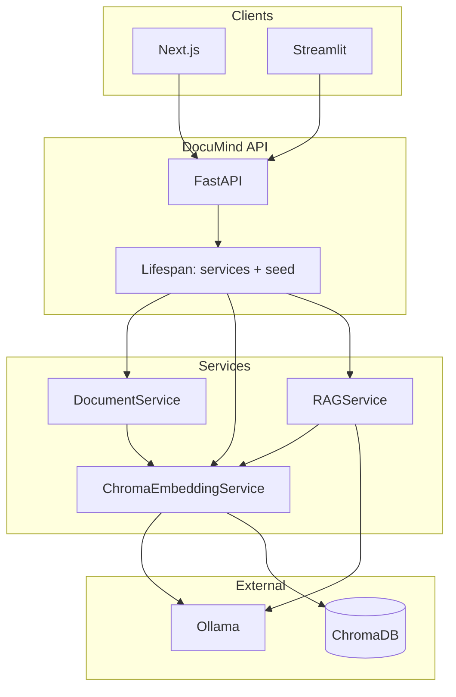

# DocuMind — Technical Reference

DocuMind is a **local-first retrieval-augmented generation (RAG)** system with **two Chroma collections**: a **public** index (default; Wikipedia-scale text via offline bulk jobs) and a **papers** index (PDFs, DOCX, `.txt`, arXiv). Documents are **ingested**, **chunked**, **embedded** into **ChromaDB** (cosine space), and **queried** through **FastAPI** with a per-request **`library`** field. Answers are **grounded** on retrieved passages, returned with **structured citations**, and shaped by **mode-specific** (and library-aware) generation policies. Default **LLM and embedding inference** run via **Ollama** on operator-controlled hardware.

This document specifies **architecture**, **control flows**, **configuration**, and **operational behavior** sufficient for engineering review, extension, and production hardening.

---

## Table of contents

1. [System overview](#1-system-overview)  
2. [Design principles](#2-design-principles)  
3. [Repository layout](#3-repository-layout)  
4. [Runtime architecture](#4-runtime-architecture)  
5. [Data lifecycle: ingest → index](#5-data-lifecycle-ingest--index)  
6. [Retrieval and generation pipeline](#6-retrieval-and-generation-pipeline)  
7. [Query modes](#7-query-modes)  
8. [FLARE-inspired active retrieval](#8-flare-inspired-active-retrieval)  
9. [HTTP API](#9-http-api)  
10. [Configuration](#10-configuration)  
11. [Security middleware](#11-security-middleware)  
12. [Observability and reliability](#12-observability-and-reliability)  
13. [Deployment](#13-deployment)  
14. [Bundled corpus and scripts](#14-bundled-corpus-and-scripts)  
15. [Testing](#15-testing)  
16. [Known limitations and extension points](#16-known-limitations-and-extension-points)  
17. [Portfolio artifacts](#17-portfolio-artifacts)  
18. [References](#18-references)  
19. [Interview narrative: quality bar, challenges, and retrieval design](#19-interview-narrative-quality-bar-challenges-and-retrieval-design)

---

## 1. System overview

| Layer | Responsibility |
|-------|------------------|
| **Presentation** | Next.js 15 dashboard (`web/`) for operator workflows; optional Streamlit (`frontend/app.py`) calling the same REST API. |
| **Application** | FastAPI application (`app/main.py`): routing, middleware, dependency injection, lifespan-managed singletons. |
| **Domain services** | Document parsing and chunking (`app/services/document_service.py`, `app/utils/chunker.py`); vector persistence (`app/services/embedding_service.py`); RAG orchestration (`app/services/rag_service.py`). |
| **Model I/O** | Ollama client (`app/utils/ollama_client.py`): chat completions and per-text embeddings over HTTP. |
| **Persistence** | Chroma persistent client on disk (`CHROMA_PERSIST_DIR`); **two** collections — `CHROMA_COLLECTION_PUBLIC` (encyclopedia-scale) and `CHROMA_COLLECTION_NAME` (papers / PDFs). Cosine space (`hnsw:space: cosine`). |

**Ports (convention):** API **8001**, Next.js dev **3002**, Ollama **11434**.

---

## 2. Design principles

1. **Grounding first** — Final user-facing answers for LLM-backed modes are conditioned only on retrieved chunk text; prompts explicitly forbid inventing papers, metrics, or datasets absent from context.  
2. **Explicit provenance** — Responses include `SourceCitation` objects (document id, title, section, page hint, chunk index, distance, preview).  
3. **Dependency-aware serving** — **Liveness** vs **readiness** split so orchestrators can distinguish “process up” from “dependencies usable”.  
4. **Configurable retrieval policy** — Top‑k, distance cutoff, keyword rerank weight, fallback when strict filtering returns nothing, and diversity caps are all **environment-tunable**.  
5. **Single-tenant baseline** — One shared library index per deployment; ACLs per document are **not** implemented in-tree (see [§16](#16-known-limitations-and-extension-points)).

---

## 3. Repository layout

| Path | Role |
|------|------|
| `app/main.py` | FastAPI app, lifespan, global exception handler, middleware, router includes. |
| `app/config.py` | `pydantic-settings` `Settings`; single cached `get_settings()`. |
| `app/logging_config.py` | Optional JSON logging layout. |
| `app/routers/ingest.py` | Multipart ingest, delete by `doc_id`. |
| `app/routers/papers.py` | List / get / delete paper metadata from index. |
| `app/routers/query.py` | RAG query and collection stats. |
| `app/routers/arxiv.py` | arXiv PDF fetch by id. |
| `app/services/document_service.py` | File type detection, text extraction, delegation to chunker. |
| `app/services/embedding_service.py` | Chroma add/query/delete; Ollama embeddings. |
| `app/services/rag_service.py` | Retrieval, rerank, diversity, mode prompts, FLARE branch, Ollama chat. |
| `app/utils/chunker.py` | `RecursiveCharacterTextSplitter`; section heuristics in metadata. |
| `app/utils/ollama_client.py` | Retry-wrapped HTTP to Ollama `/api/chat` and `/api/embeddings`. |
| `app/models/` | Pydantic request/response models shared by routers. |
| `data/sample_docs/` | Bundled UTF-8 corpus (see [§14](#14-bundled-corpus-and-scripts)). |
| `tests/` | API and unit tests; `tests/conftest.py` uses dependency overrides and fake embedding/RAG for isolation. |
| `evaluation/` | Optional regression fixtures for pipeline shape. |
| `scripts/` | Corpus generators, portfolio PDF, arXiv bulk helpers. |
| `web/` | Next.js operator UI. |
| `Dockerfile` / `docker-compose.yml` | Container image (Python 3.11-slim, non-root) and Compose stack with Chroma volume + healthcheck. |

---

## 4. Runtime architecture



**Lifespan (`app/main.py`):** On startup, constructs `OllamaClient`, one shared **`chromadb.PersistentClient`** on `CHROMA_PERSIST_DIR`, then an **`EmbeddingRegistry`** with two **`ChromaEmbeddingService`** wrappers (papers + public collections) and two **`RAGService`** instances (`content_library` each). Sharing one client avoids double-opening the same SQLite store. Optionally runs **`seed_sample_docs`** into the **papers** collection only when **`SEED_SAMPLE_DOCS=true`**: compares `SAMPLE_CORPUS_VERSION` marker on disk to settings; on mismatch, deletes `sample_*` vectors in that collection, rewrites marker, then ingests each `data/sample_docs/*.txt` as `sample_<stem>`. The **public** collection is empty until you run **`scripts/bulk_index_public.py`** or **`scripts/build_public_corpus.py`** (or `POST /api/v1/ingest` with `library=public`).

**Routers** mount under `/api/v1` except health routes at root.

---

## 5. Data lifecycle: ingest → index

### 5.1 Ingestion

- **Input:** `POST /api/v1/ingest` (`multipart/form-data`: file + optional `library` field, default **`public`**) or `POST /api/v1/fetch-arxiv` (JSON `arxiv_id`; always indexes **papers**).  
- **Validation:** File size cap `MAX_FILE_SIZE_MB`; MIME/type checks in ingest router / document service.  
- **Extraction:** PyPDF2 for PDF, python-docx for DOCX, raw decode for `.txt`.  
- **Metadata:** Heuristic title, authors, year, optional arXiv id from leading text when parseable.  
- **Chunking:** `DocumentChunker` uses LangChain `RecursiveCharacterTextSplitter` with `CHUNK_SIZE` and `CHUNK_OVERLAP`. Each `langchain_core.documents.Document` carries metadata: `doc_id`, `filename`, `section` (heuristic), `chunk_index`, `page_number` when known, etc.  
- **Indexing:** `ChromaEmbeddingService.add_documents` (HTTP path) or **`add_indexed_batch`** (bulk indexer) embeds chunks via Ollama `EMBEDDING_MODEL`, writes to the selected collection with stable ids `{doc_id}_{i}`. Each chunk metadata is stamped with **`embedding_model`**, **`chroma_collection`**, and **`indexed_at`** (UTC) for re-embed and drift workflows.  

### 5.2 Deletion semantics

`DELETE /api/v1/papers/{doc_id}` and `DELETE /api/v1/ingest/{doc_id}` call `embedding_service.delete_document`. If no chunks exist for that `doc_id`, the service returns **false** and the API responds **404** — empty delete is not silently successful.

### 5.3 Vector space

Each Chroma collection is created with `metadata={"hnsw:space": "cosine"}`. Query results expose **distance** per hit; the RAG layer sorts ascending (**lower distance = closer match**) and keeps rows with **`distance < RELEVANCE_THRESHOLD`** before optional fallback (threshold is a tunable cutoff on this distance scale for your embedding model and corpus).

---

## 6. Retrieval and generation pipeline

All logic below is implemented in `app/services/rag_service.py` unless noted.

### 6.1 Retrieval budget

For a user `top_k` and `query_mode`, the service expands the **vector search** `n_results` before reranking (e.g. up to 64 for `general` / `compare`, up to 56 for other modes). This widens the candidate pool so rerank and diversity filters have material to work with.

### 6.2 Vector search and rerank

1. `embedding_service.search(embed_query, retrieve_k, section_filter)` returns rows `{content, metadata, distance}`.  
2. **Keyword rerank:** Rows are sorted by  
   `distance − KEYWORD_RERANK_WEIGHT × keyword_overlap_score(rerank_query, content)`  
   so lexical overlap with the user question can reorder within a distance band.  
3. **Threshold filter:** Keep rows with `distance < RELEVANCE_THRESHOLD`.  
4. **Fallback:** If nothing passes and `ENABLE_FALLBACK_RETRIEVAL` is true, take the top `FALLBACK_TOP_N` by rerank order and mark internally (answer may append a disclosure line).  
5. **Diversity:** `_select_diverse_sources` prefers at most one strong chunk per `doc_id` before filling remaining slots, reducing single-document context monopolization.  
6. **Context slot cap:** Depends on `query_mode` (e.g. up to 24 chunks for `general` / `compare`).

### 6.3 Generation

- **`datasets` mode:** Does **not** call the LLM for the main body. It scans retrieved chunk text for known dataset hints and patterns, emits a structured Markdown inventory. FLARE is **skipped**.  
- **Other modes:** Builds a single context block from selected chunks, applies the mode’s system prompt (`SYSTEM_PROMPTS` for **papers**, `PUBLIC_SYSTEM_PROMPTS` for **public**), calls `OllamaClient.chat` with mode-dependent temperature, returns Markdown answer plus `SourceCitation` list.  
- **Confidence:** Derived from mean chunk distance (clamped); exposed as a scalar for UI.

---

## 7. Query modes

| `query_mode` | Behavior |
|--------------|----------|
| `general` | Broad grounded synthesis; higher temperature than methodology. |
| `compare` | Cross-paper comparison framing; large retrieval budget; table-oriented prompt. |
| `methodology` | Implementation-focused extraction; moderate temperature. |
| `datasets` | Deterministic dataset / benchmark surfacing from chunk text. |
| `reproduce` | Reproducibility checklist style; structured sections in prompt. |

Optional **`section_filter`** restricts Chroma `where` clause on metadata `section` (abstract, introduction, methodology, experiments, results, conclusion).

---

## 8. FLARE-inspired active retrieval

**Scope:** FLARE here is **not** a substitute for RAG—it is an **optional second retrieval pass** on top of the same dense-vector RAG pipeline (retrieve → optionally retrieve again with a richer query → merge → generate). The default path is still **single-pass RAG** unless `use_flare` or `FLARE_ACTIVE_RETRIEVAL` turns this on.

Full **FLARE** ([Jiang et al., arXiv:2305.06983](https://arxiv.org/abs/2305.06983)) uses **token-level confidence** to trigger mid-generation retrieval. Ollama’s chat API used here does **not** expose per-token logprobs.

**Implementation:** When `use_flare` (request) or `FLARE_ACTIVE_RETRIEVAL` (settings) is true and mode ≠ `datasets`:

1. Run the standard first-pass retrieval → context selection.  
2. Build a **truncated mini-context** (bounded by `FLARE_DRAFT_MAX_CONTEXT_CHARS`) from selected chunks.  
3. Call the LLM once with `FLARE_DRAFT_SYSTEM` to produce a **2–4 sentence forward-looking draft**; unsupported facts must appear as `???` or explicit excerpt-level hedges.  
4. If `flare_triggers_follow_up(draft)` is true, run a **second** `search` with a composite query (user question + draft excerpt, capped length).  
5. **Merge** reranked lists by chunk identity, keeping the **better** (lower) distance per chunk; re-run threshold, fallback, and diversity on the merged set.  
6. Final synthesis uses merged chunks. Response fields `flare_enabled` and `flare_followup_retrieval` record what occurred.

### 8.1 Alternatives considered (and why this FLARE-shaped path)

| Approach | Idea | Why it is not the default here |
|----------|------|--------------------------------|
| **Token-level FLARE** (paper-faithful) | Use per-token confidence from the generator to trigger retrieval mid-stream. | **Ollama’s `/api/chat` does not expose logprobs**; wiring OpenAI logprobs would fork the inference abstraction. |
| **HyDE** | LLM hallucinates a hypothetical document; embed that for retrieval. | Extra latency + **hallucinated retrieval queries** can pollute dense search on technical corpora unless heavily guarded. |
| **Multi-query / RAG-Fusion** | LLM emits several sub-queries; retrieve per query; fuse (RRF). | Strong for recall; **cost and latency scale with query count**; harder to explain citations per sub-query in a portfolio UI. |
| **Self-RAG / CRAG** | Model judges “is retrieval needed?” and quality of hits; may rewrite queries. | Heavier **orchestration and eval surface**; many steps for a local single-GPU demo. |
| **Re-ranker only** (cross-encoder) | Keep one retrieval pass; rerank with a second model. | Excellent production pattern; **not bundled** to keep the stack Ollama-centric and CPU-light for reviewers cloning cold. |

**Why FLARE-shaped active retrieval anyway:** It is **literature-grounded** (easy to cite Jiang et al. in interviews), **bounded** (one draft call + at most one follow-up search), and **honest about constraints** (draft uses `???` / hedges instead of fake logprobs). It demonstrates you understand **when to stop retrieving** and how to **merge evidence** from two passes—without pretending the host is a commercial API.

---

## 9. HTTP API

| Method | Path | Body / params | Notes |
|--------|------|---------------|--------|
| GET | `/health` | — | Ollama availability + stats for **`DEFAULT_LIBRARY`** collection. |
| GET | `/health/live` | — | Process liveness. |
| GET | `/health/ready` | — | **503** if dependencies not ready. |
| GET | `/api/v1/libraries` | — | **Both** collections’ `CollectionStats` + `default_library` (ops / capacity). |
| POST | `/api/v1/ingest` | `multipart/form-data`: `file`, optional `library` | Indexes into **public** or **papers**. |
| DELETE | `/api/v1/ingest/{doc_id}` | Query `?library=` (default `public`) | **404** if no chunks. |
| POST | `/api/v1/fetch-arxiv` | `{ "arxiv_id": "..." }` | Downloads PDF; indexes **papers** only. |
| POST | `/api/v1/query` | `QueryRequest` JSON (`library` default `public`) | See `app/models/request_models.py`. |
| GET | `/api/v1/papers` | Query `?library=` | Library cards. |
| GET | `/api/v1/papers/{doc_id}` | Query `?library=` | One document. |
| DELETE | `/api/v1/papers/{doc_id}` | Query `?library=` | **404** if no chunks. |
| GET | `/api/v1/collection/stats` | Query `?library=` | Aggregate counts for one collection. |

**OpenAPI:** `/docs`, `/redoc`, `/openapi.json` unless `DISABLE_OPENAPI=true`.

**Authentication:** When `API_KEY` is non-empty, all `/api/v1/*` routes (except CORS preflight) require header **`X-API-Key`** matching the setting; mismatch → **401**.

---

## 10. Configuration

All keys are listed in **`.env.example`**. Grouped reference:

| Group | Variables | Purpose |
|-------|-----------|---------|
| **Models** | `OLLAMA_BASE_URL`, `LLM_MODEL`, `EMBEDDING_MODEL` | Inference endpoints and model tags. |
| **Vector store** | `CHROMA_PERSIST_DIR`, `CHROMA_COLLECTION_NAME`, `CHROMA_COLLECTION_PUBLIC`, `DEFAULT_LIBRARY` | On-disk path; **papers** vs **public** collection names; default `library` for `/health` stats. |
| **Chunking** | `CHUNK_SIZE`, `CHUNK_OVERLAP` | Text splitter parameters; affects chunk count and context granularity. |
| **Retrieval defaults** | `TOP_K_RESULTS`, `RELEVANCE_THRESHOLD`, `ENABLE_FALLBACK_RETRIEVAL`, `FALLBACK_TOP_N`, `KEYWORD_RERANK_WEIGHT` | Global defaults; per-request `top_k` overrides for query. |
| **Ingest** | `MAX_FILE_SIZE_MB`, `ARXIV_BASE_URL` | Upload cap and arXiv PDF export host. |
| **Sample corpus** | `SAMPLE_CORPUS_VERSION`, `SEED_SAMPLE_DOCS` | Bump version to purge/re-seed `sample_*` in **papers** when `SEED_SAMPLE_DOCS=true`. |
| **Network** | `CORS_ORIGINS`, `CORS_ALLOW_ALL`, `TRUSTED_HOSTS` | Browser and Host-header policy. |
| **App** | `APP_ENV`, `DISABLE_OPENAPI` | Environment label; docs toggle. |
| **Security / transport** | `API_KEY`, `ENABLE_RESPONSE_GZIP` | Optional API key gate; gzip responses. |
| **Logging** | `LOG_LEVEL`, `LOG_JSON` | Verbosity and JSON log lines. |
| **FLARE** | `FLARE_ACTIVE_RETRIEVAL`, `FLARE_DRAFT_MAX_CONTEXT_CHARS` | Global FLARE default and draft context budget. |

---

## 11. Security middleware

Applied in `app/main.py` (order matters for FastAPI / Starlette):

- **CORS** — `CORSMiddleware` with explicit origins or wildcard when `CORS_ALLOW_ALL` (dev-only).  
- **Trusted hosts** — Optional `TrustedHostMiddleware` when `TRUSTED_HOSTS` is set.  
- **Gzip** — `GZipMiddleware` when `ENABLE_RESPONSE_GZIP` and payload exceeds minimum size.  
- **Per-request** — `X-Request-ID` assignment, optional API key gate, default security headers (`X-Content-Type-Options`, `X-Frame-Options`, `Referrer-Policy`; `Permissions-Policy` in production `APP_ENV`).  
- **Errors** — `HTTPException` and `RequestValidationError` return structured JSON; uncaught exceptions return **500** with `request_id` in body.

---

## 12. Observability and reliability

- **Request correlation** — Every response carries `X-Request-ID`; access logs include `request_id`, method, path, status, `duration_ms`.  
- **Structured logs** — `LOG_JSON=true` for log platforms.  
- **Healthchecks** — Docker Compose defines an HTTP probe against `/health/live` (see `docker-compose.yml`). Prefer `/health/ready` for LB routing when Ollama and Chroma must be live.  
- **Chroma persist corruption (development)** — If opening the store raises a recoverable Chroma/Rust error (`APP_ENV=development`), the API **renames** `CHROMA_PERSIST_DIR` to a sibling `*.broken.<UTC>` folder, then **exits startup with `RuntimeError`**. **Restart the process once** so a fresh Python interpreter opens the new empty directory (PyO3 panics can poison in-process bindings; an immediate re-open in the same process is unsafe). Production/staging surfaces the error without renaming.

---

## 13. Deployment

| Target | Command / notes |
|--------|------------------|
| **Docker Compose** | `docker compose up --build` — publishes **8001**, mounts Chroma volume `chroma_data`, read-only `./data`. Set `OLLAMA_BASE_URL` to reachable Ollama (default `host.docker.internal:11434` on Docker Desktop). |
| **Bare metal / VM** | `uvicorn app.main:app --host 0.0.0.0 --port 8001` (add `--proxy-headers` behind TLS terminator per your platform). |
| **Windows dev** | `.\start_documind.ps1` (Ollama, API, Next); uses `.venv\Scripts\python.exe` when present. **First boot** can sit in corpus ingest for a long time before `/health` responds; the script waits up to **180** minutes (`-MaxApiWaitMinutes`). `-SkipModelPull` speeds repeat boots. `.\stop_documind.ps1` clears ports **3002**, **8001**, **11434** — confirm Ollama shutdown is intended. |

**Backup:** Copy `CHROMA_PERSIST_DIR` regularly; it is the authoritative index. Source PDFs/DOCX should remain in object storage or VCS-independent archives if they are not all under `data/`.

---

## 14. Bundled corpus, public scale, and scripts

### What ships in git (small)

- **`data/sample_docs/`** — On the order of **~460** UTF-8 files (~**1 MB** text): curated summaries plus **400** synthetic `sample_corpus_p7_*.txt` from `scripts/generate_production_corpus.py`. This is **not** a massive real-world KB; it is optional demo material for the **papers** collection when `SEED_SAMPLE_DOCS=true`.  
- **Chroma in the repo clone** — Often **tens of MB** after local indexing; size grows with **chunk count × (vectors + stored text + HNSW)**. Empty **public** collection adds negligible disk until you bulk-index.

### Making the **public** corpus massive (operator job)

1. **`pip install datasets`** (for Hugging Face streaming).  
2. **One command (stream + bulk index):**  
   `python scripts/build_public_corpus.py --articles 10000`  
   Use `--articles 50000` or higher for serious scale; `--articles 0 --allow-unbounded` streams the full dump (disk-hungry).  
3. **Piecemeal:** `scripts/stream_wikipedia_to_txt.py` → `scripts/bulk_index_public.py` (`--dry-run` for chunk estimates, `--checkpoint` for resume, `--workers` for parallel Ollama embeds).  
4. **Ops:** `GET /api/v1/libraries` for both collections’ chunk and document counts.

### Other scripts

- **Regeneration (papers bundle):** `python scripts/generate_production_corpus.py --count 500 --force` then bump `SAMPLE_CORPUS_VERSION` (with `SEED_SAMPLE_DOCS=true`).  
- **Hand-authored expansion:** `scripts/materialize_institutional_corpus.py`.  
- **arXiv bulk:** `scripts/bulk_ingest_arxiv.py` + `data/arxiv_seed_list.txt` (indexes **papers**).

---

## 15. Testing

```bash
pytest -q
```

`tests/conftest.py` overrides FastAPI dependencies with fake embedding/RAG services so unit tests do not require Ollama or Chroma.

**Query regression suite:** `tests/test_rag_query_suite.py` runs **20** parameterized cases (`tests/query_eval_cases.py`) against **real `RAGService`** with a **ranking fake vector layer** (`tests/ranking_fake_embedding.py`) and a deterministic Ollama stub — metrics cover status, `has_answer`, source counts, answer substrings, and wall time. **Live library smoke:** `python scripts/run_query_eval.py --base-url http://127.0.0.1:8001` (optional `--csv report.csv`; skips empty-corpus cases with `--skip-empty-corpus-cases`).

**CI:** On push and pull request to `main` or `master`, GitHub Actions (`.github/workflows/ci.yml`) runs on **Python 3.11 and 3.12**: `ruff check` (syntax / undefined-name rules), then **`pytest`**. No Ollama or Chroma in CI. Pytest and Ruff defaults: **`pyproject.toml`**. Dependabot for Actions: **`.github/dependabot.yml`**.

---

## 16. Known limitations and extension points

Not implemented in this repository (non-exhaustive):

- Per-user or per-tenant **ACL** on chunks or documents.  
- **SSO** / OIDC for the API or UI.  
- **OCR** pipeline for low-quality scanned PDFs beyond basic text extraction.  
- **Hosted** managed vector SaaS swap (Pinecone, Weaviate, etc.) — would replace `ChromaEmbeddingService` while preserving router contracts.  
- **Token-level FLARE** — requires a host that exposes logprobs or an alternative uncertainty model.  
- **Chroma auto-quarantine** — development-only; requires **one manual restart** after a bad on-disk store is moved aside (see [§12](#12-observability-and-reliability)).

Natural extensions: swap Ollama for OpenAI/Azure OpenAI behind the same `RAGService` boundary; add golden-set eval CI; wire `/health/ready` to load balancers; add cross-encoder reranking as an optional second stage.

---

## 17. Portfolio artifacts

Under **`portfolio/`**: client project catalog HTML, portfolio brief HTML, optional PDF generation (`scripts/portfolio_requirements.txt`, `scripts/generate_portfolio_pdf.py`), dashboard screenshot **`portfolio/screenshots/documind-dashboard.png`**.

**Regenerating the screenshot (recommended):** A bare `playwright screenshot` of the home page misses indexed doc counts and synthesis. Use the bundled driver after API + Next are up and sample ingest has progressed:

```powershell
.\.venv\Scripts\pip install -r scripts\screenshot_requirements.txt
.\.venv\Scripts\playwright install chromium
.\scripts\capture_dashboard.ps1                    # waits for /health/live, Gold demo scenario (compare, Top K 24, FLARE), synthesis text, tall-viewport PNG
# Smaller corpus / faster index gate:  .\scripts\capture_dashboard.ps1 -MinDocs 40
# Custom API / wait cap:                .\scripts\capture_dashboard.ps1 -ApiBase "http://127.0.0.1:8001" -MaxLivenessWaitMinutes 240
```

Or directly: `.\.venv\Scripts\python scripts\capture_dashboard_playwright.py --help` — waits for **≥120 chars** in `.prose-answer`, scrolls synthesis into view, writes **1680×3200** `portfolio/screenshots/documind-dashboard.png` (default `--viewport-width 1680`; use `--viewport-width 1440` if needed), then **1000×750** `portfolio/screenshots/documind-upwork-catalog-1000x750.png` (default stack infographic tile; `--plain-catalog-thumb` top-crops the dashboard). Thumb only: `.\.venv\Scripts\python scripts\capture_dashboard_playwright.py --thumb-only`. Standalone tile: `python scripts/catalog_thumb_art.py --out portfolio/screenshots/documind-upwork-catalog-1000x750.png`. Avoid `--full-page` for portfolio assets.

---

## 18. References

- Jiang et al., *Active Retrieval Augmented Generation (FLARE)*, [arXiv:2305.06983](https://arxiv.org/abs/2305.06983).  
- Gao et al., *Precise Zero-Shot Dense Retrieval without Relevance Labels* (HyDE), [arXiv:2212.10496](https://arxiv.org/abs/2212.10496).  
- FastAPI, Pydantic v2, ChromaDB, LangChain text splitters, Ollama HTTP API.

---

## 19. Interview narrative: quality bar, challenges, and retrieval design

### What this repo actually proves

- **Senior IC–level system design:** dual corpora (`library` routing), explicit provenance on chunks, **live vs ready** health, optional API key, structured errors with `request_id`, Docker + Compose, regression tests that **do not** require GPU clusters in CI.  
- **RAG depth beyond “call OpenAI”:** retrieval budget by mode, keyword rerank, diversity cap, fallback when the strict distance filter starves, optional **second retrieval pass** with merge semantics, deterministic `datasets` mode for grounded extraction without generative drift.

### Where it is *not* “FAANG production” (say this confidently)

- **Single-tenant / no row-level ACL**, no SSO, no rate limiting or quota service, no multi-region active-active.  
- **Ollama-centric** inference: great for reproducible demos; production would likely pin **vendor APIs** or **vLLM** behind autoscaling with SLO dashboards.  
- **Chroma embedded SQLite** on disk: fine for many products; hyperscale teams often move vectors to **managed** stores (e.g. Pinecone, Weaviate Cloud, Aurora pgvector) with backup/restore runbooks.  
- **CI does not run** full embedding + LLM golden paths—by design for cost; **live** `scripts/run_query_eval.py` is the operator’s integration check.

### Challenges you can talk through (STAR-friendly)

1. **Dual library without doubling connections** — Two logical indexes, one `PersistentClient`, two collections; avoids subtle SQLite / Rust binding issues from opening the same path twice.  
2. **Chroma 1.x + legacy on-disk stores** — Upstream issues (e.g. chroma-core/chroma#5909) can surface as **Rust panics**; development path **quarantines** the directory and **forces a restart** so the interpreter is not left with poisoned native bindings after PyO3 failure.  
3. **Active retrieval without logprobs** — Full FLARE is token-conditional; this stack uses a **draft + lexical/regex uncertainty gate** (`flare_triggers_follow_up`) so behavior stays testable and bounded.  
4. **Evaluating RAG without flaky LLM output in CI** — `tests/test_rag_query_suite.py` uses a **deterministic stub** for chat and a ranking-aware fake embedding layer so structural expectations stay stable.

### Sound-bites for “why not only FLARE / what else did you consider?”

Point to [§8.1](#81-alternatives-considered-and-why-this-flare-shaped-path): HyDE, multi-query fusion, rerank-only, self-RAG/CRAG vs **bounded FLARE-shaped** retrieval under **local API constraints**.

### If you want this to read even more “hire me” in the next iteration

Prioritize a **short design doc PR**: cross-encoder rerank behind a flag, **OpenTelemetry** spans on retrieve vs generate, **Ragas** or similar on a frozen eval JSONL, and a **one-page SLO table** (p95 latency, error budget). Those are high signal per line of code for staff+ loops.

---

## Stack summary

Python **3.11+** (Dockerfile pins 3.11-slim), FastAPI, Uvicorn, Pydantic Settings, ChromaDB, `langchain_core` + `langchain-text-splitters`, Ollama, Next.js 15, React 18, TypeScript, pytest, optional Streamlit.
